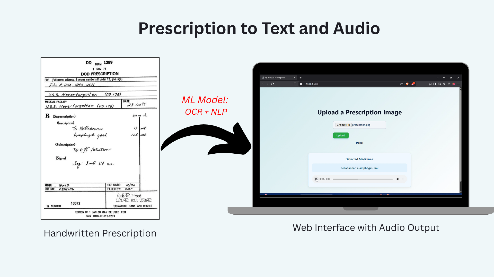

# Handwritten Medicine Prescription to Text and Audio Conversion

## 📖 About the Project

This project is an extension of the [ScanPlus](https://github.com/Gupta-Aryaman/scanPlus) system, which is designed to convert handwritten doctor's prescriptions into machine-readable text. It uses Optical Character Recognition (OCR) and Named Entity Recognition (NER) models to extract information like medicine names, dosages, and schedules. My version builds on this core functionality and adds a **Text-to-Speech (TTS)** feature to enhance accessibility, especially for people with disabilities such as visual impairments or reading difficulties.

## 📸 Project Overview

The diagram below shows the end-to-end workflow, from scanned input to processed output.

<p align="center">
  
</p>

 ---
 
### **Key Features:**
- **OCR Integration:** Uses OCR techniques to convert handwritten prescriptions into machine-readable text.
- **NER Model:** Classifies the extracted text to identify relevant categories such as medicine names and dosages. The NER model is the same one used in the original ScanPlus project, which leverages **BERT Embedding**, **CHAR CNN-BiLSTM**, and **CRF** techniques.
- **Text-to-Speech (TTS):** Converts the processed prescription text (medicine names, dosages, and instructions) into audio, making it easier for patients with disabilities to access the information.

---

## 🎬 Live Demo

Here’s the project in action:

<p align="center">
  
</p>

## ⚙️ **Approach**

This project enhances the [ScanPlus](https://github.com/Gupta-Aryaman/scanPlus) pipeline by focusing on improving accessibility for patients, especially those with visual or cognitive impairments. 

**The workflow:**
1. **OCR (AWS Textract)** converts handwritten prescriptions into machine-readable text.
2. **NER (Named Entity Recognition):** The extracted text is processed by the same NER model from ScanPlus, which identifies medicine names, dosages, and schedules.
3. **Text-to-Speech (TTS):** The extracted information is converted into speech, making the prescription information accessible for visually impaired patients.

---

## 🛠️ **Technologies Used**

- **Python**
- **AWS Textract** for OCR (Optical Character Recognition)
- **BERT** and **BiLSTM-CRF** for NER (Named Entity Recognition)
- **Text-to-Speech (TTS):** For making prescriptions accessible through speech
- **Flask:** For web interface 

---

## 👩‍💻 **Set-up Instructions**

1. Clone this repository:
   ```bash
   git clone https://github.com/sathvikak255/prescription-to-text-and-audio.git
   cd prescription-to-text-and-audio
   ```
2. Create Virtual Environment:
   ```bash
   python -m venv venv
   source venv/bin/activate      #On Windows use `venv\Scripts\activate`
   
3. Install dependencies:
     ```bash
     pip install -r requirements.txt
     ```
4. Configure AWS Textract:
   - Ensure you have AWS credentials configured. You can use the AWS CLI to set this up:
   ```bash
   aws configure
   ```
   - Add your region_name, aws_access_key_id and aws_secret_access_key in the api/ml_model/ml_model.py file.
5. Create the model
- Go in api/ml_model folder, and open ner.py
- Call the train_model function to the ner train the model. (make sure to pass the AWS Credentials in the detect_text() method.)
6. Run the application:
   ```bash
   cd api/
   python api.py
   ```
7. Use the TTS feature by uploading a prescription image, and the app will generate both text and speech output.

## 🎓 About ScanPlus
ScanPlus is a powerful system that aims to digitize handwritten prescriptions and categorize them automatically. Here’s a quick overview of what ScanPlus does:

- AWS Textract: Extracts text from handwritten prescriptions.
- NER (Named Entity Recognition): Classifies extracted text into categories like medicine names and dosages.
- Alert System: Sends an email with prescription details to the patient's registered email.

For more information, check out the original ScanPlus repository.
https://github.com/Gupta-Aryaman/scanPlus

## 🎯 Additional Notes
This project highlights the importance of making healthcare information accessible to everyone, especially patients with disabilities. By converting prescription details into speech, we aim to reduce the barriers faced by people with visual impairments and help them better manage their health. 
